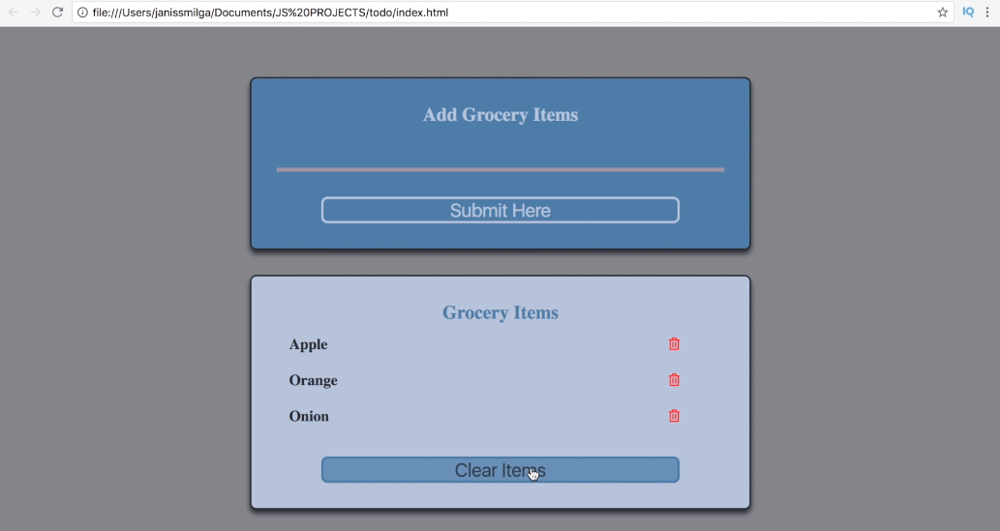
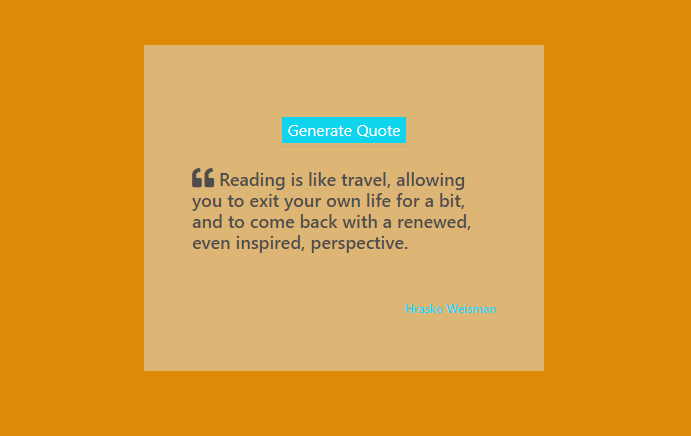
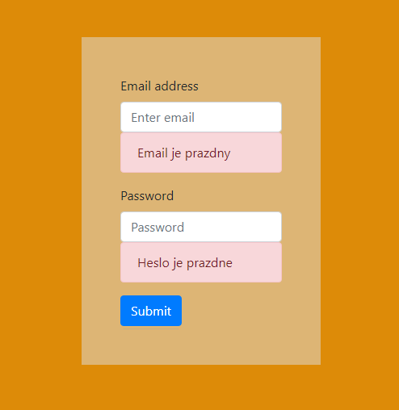
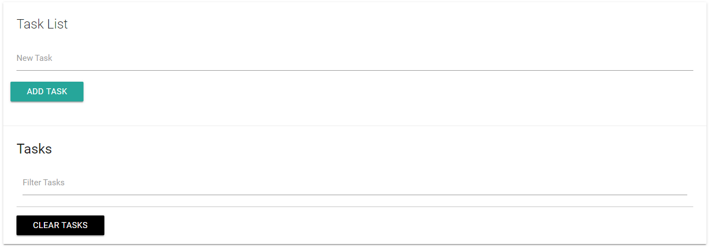
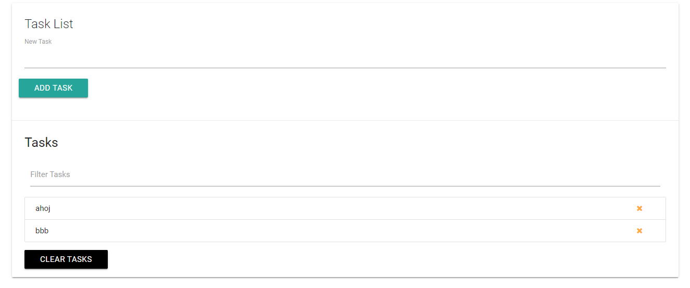
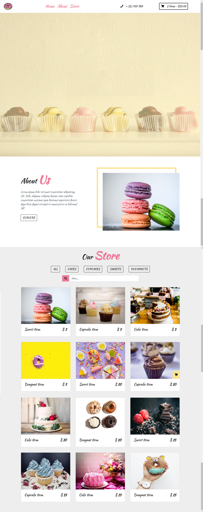
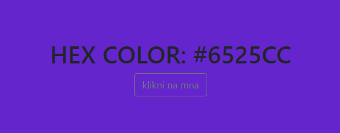
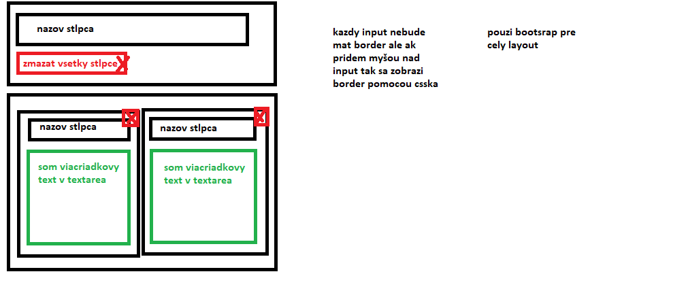

# js-my-examples

## 1. Grocery list
 
[demo](https://ludmilajalcova.github.io/js-grocery-list/)

## 2. Quotes generator
 
[demo](https://ludmilajalcova.github.io/js-quotes-generator/)

## 3. Email and password validation
 
[demo](https://ludmilajalcova.github.io/js-validation-email-password/)

## 4. Image slider 1
 
[demo](https://ludmilajalcova.github.io/js-image-slider/)

## 5. Image slider 2
 
[demo](https://ludmilajalcova.github.io/js-image-slider-2/#)

## 6. Task list
 
 
[demo](https://ludmilajalcova.github.io/js-task-list/?#) 

## 7. Filter project
 
[demo](https://ludmilajalcova.github.io/js-filter-project/) 

## 8. Color generator
 
[demo](https://ludmilajalcova.github.io/js-color-generator/) 

## 9. Jira project
 
[demo](https://ludmilajalcova.github.io/js-jira/) 

